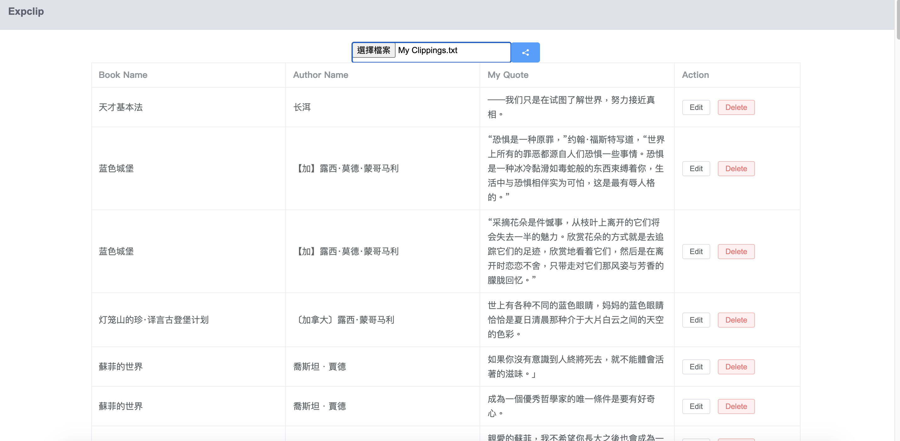

# Expclip


This is a Vue Application that enables Kindle users to view, edit and manage their highlights in My Clipping.txt file. 


## Build Setup
```bash
# install dependencies
npm install

# serve with hot reload at localhost:8080
npm run serve

# build for production
npm run build

```


## Screenshot 
