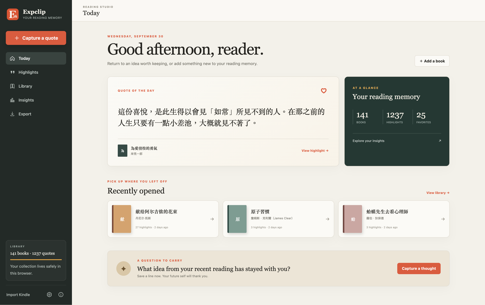
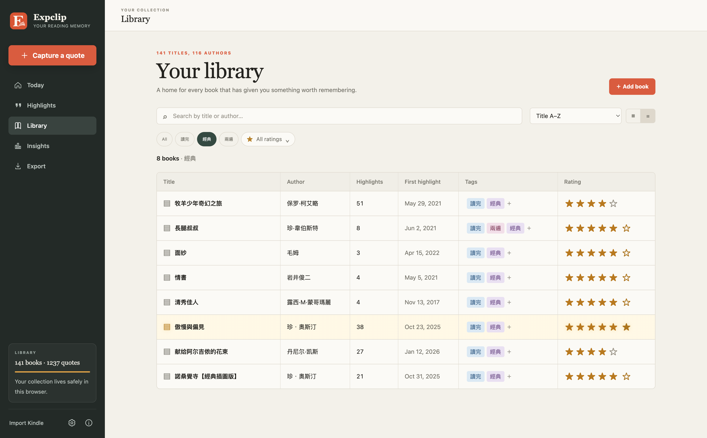
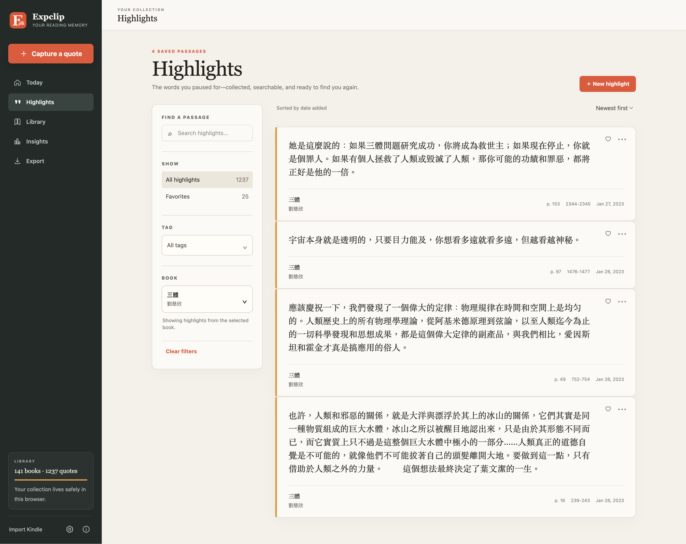
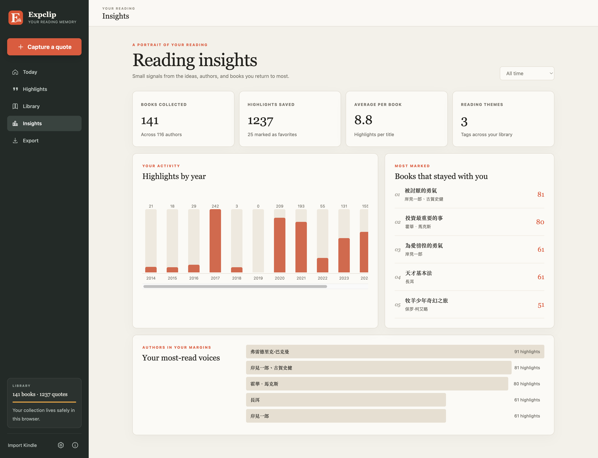
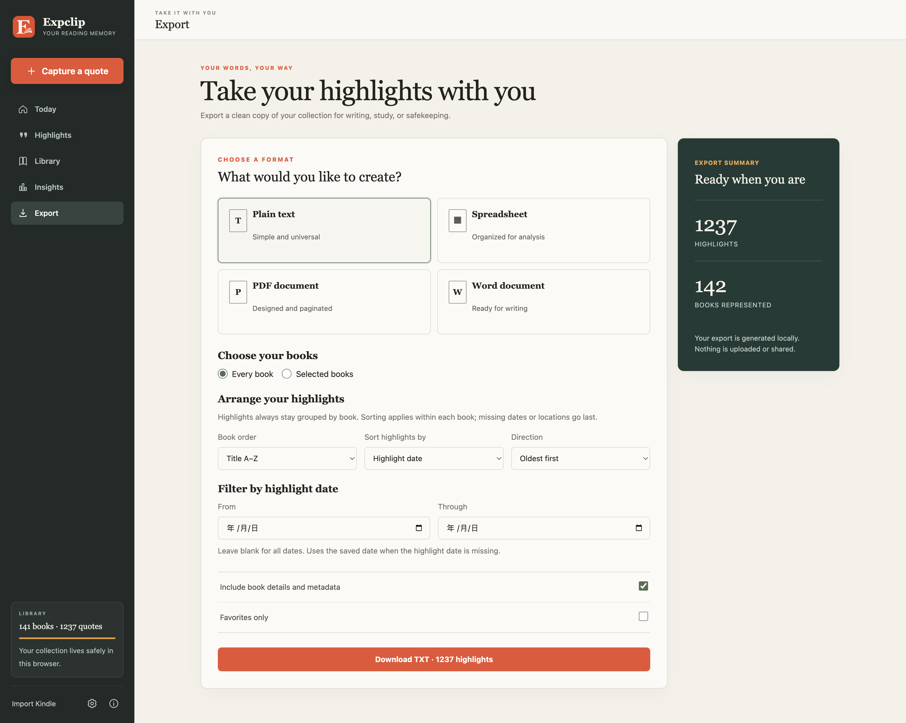

# Expclip

A personal library for the passages you want to keep. Import Kindle highlights, organize books and quotes, add notes, explore your reading activity, and export your collection.

Built with Vue 3, Pinia, Vue Router, and Vite. Your library is saved locally in your browser; no account is required.

## Getting started

Requires Node.js 20 or newer and npm.

```sh
npm ci
npm run dev
```

Open the address printed by Vite, normally `http://localhost:5173/Expclip/`.

If you see `vite: command not found`, run `npm ci` from the project folder before starting the development server.

PDF export needs a separately downloaded and prepared font. Follow the [PDF font setup guide](public/fonts/README.md) to enable it. The rest of the app works without this font.

### Development commands

```sh
npm test          # Run regression tests
npm run build    # Build the app into dist/
npm run preview  # Preview the production build locally
npm run deploy   # Build locally and publish dist/ to origin/gh-pages
```

## Screenshots

### Today



### Library



### Highlights



### Insights



### Export



## Explore your collection

### Today

A home dashboard with a quote of the day, collection totals, and recent books. Save a daily quote as a favorite, or use **Capture a quote** in the sidebar to add a highlight manually.

### Library

- Switch between a cover grid and a Notion-style list.
- Search by book title or author, and filter by tags or an exact star rating.
- Sort titles A–Z or Z–A, or sort by each book's first highlight, newest or oldest first.
- See the number of books matching your current filters.
- Edit tags directly in the list: choose existing tags, create new ones, and change their colors.
- Rate books in the list or on their detail page. Click the selected star again to clear the rating. Selecting five stars reveals a special sixth star; six-star books have a shimmering list background.
- Keep your search, filters, sort order, and view choice when returning to the Library.

Use **Add book** to create a title manually. Open a book to edit its details, browse its highlights, and sort those highlights by date or numeric location in either direction.

Saving book details with a title and author that exactly match another book offers to merge the books. The merge transfers highlights and notes and combines book metadata; it does not deduplicate transferred highlights.

To delete a book, open **Edit details** and choose **Delete book**. After confirmation, the book and all its related highlights and notes are permanently removed.

### Highlights

- Search quote text and combine filters for favorites, highlight tags, and books.
- Choose books with a searchable picker and tags with a searchable, colored dropdown.
- Change highlight colors using the animated menu on a quote's colored edge.
- Favorite quotes to give them a subtle sparkling background.
- Use the three-dot menu to edit text, add a note or tags, or delete a highlight.
- Edit existing notes and tags directly on the card. Tag editing supports searching, creating tags, and choosing shared tag colors.

Book tags and highlight tags are separate collections, with their own shared colors.

### Insights

- **All time:** lifetime collection statistics, book and author rankings, and highlight counts by year.
- **This year:** statistics for the current calendar year, monthly highlight counts from January to December, and a GitHub-style daily activity heatmap.

Activity uses the highlight date, falling back to the date added when no highlight date is available. “This year” means the current calendar year, not a rolling 365-day window.

## Import Kindle highlights

1. Copy `My Clippings.txt` from your Kindle's `documents` folder.
2. Click **Import Kindle** at the bottom of the sidebar.
3. Choose the `.txt` file or drag and drop it into the import area.
4. Import the file and check the result summary.

The importer handles English Kindle clipping metadata, including records without an author or page number. Exact duplicate records are skipped both within the imported file and against saved highlights. Matching compares the book title, author, quote text, page, location, and highlight date; identical text at different locations or dates is kept.

Reimporting does not overwrite saved favorites, colors, notes, or tags. It also does not remove duplicates already in your library or automatically repair previously imported records.

## Export highlights

The **Export** page supports four formats, generated in your browser:

| Format | Best for |
| --- | --- |
| TXT | Plain-text reading and copying |
| CSV | Spreadsheets and further analysis; UTF-8 with a BOM |
| PDF | A formatted reading document with embedded Chinese font support |
| Word (.docx) | An editable document without embedded font files |

All four formats let you:

- Export every book or select specific books using a searchable list.
- Order books by title A–Z, title Z–A, first highlight newest first, or library order.
- Sort highlights by date or numeric location, ascending or descending, while always keeping them grouped by book.
- Filter by an inclusive date range or export favorites only.
- Include or omit book details and highlight metadata such as page, location, and date.
- Preview the number of matching books and highlights before exporting.

“First highlight” ordering uses the earliest highlight for each book across the library, rather than the date the book was added. Export filters do not change that ordering date.

PDF exports use your configured font, embedding only the glyphs needed by the document to reduce file size. The recommended Source Han Serif font supports both Traditional and Simplified Chinese; custom fonts must cover the characters you export. Word exports use installed fonts instead, so their appearance can vary between devices.

These four formats export quote content and optional metadata, not highlight notes or tags. Use a JSON backup to preserve your library for restoration.

## Storage, backup, and restore

Books, highlights, and preferences are stored in your browser's `localStorage`. There is no automatic cloud sync or automatic backup. Data belongs to the browser profile and site origin you use; switching browsers or clearing site data can make your collection unavailable.

Open the **Settings** gear at the bottom of the sidebar, then **Manage data**:

- **Download backup** saves a JSON file containing books, highlights (including notes and tags), and book/highlight tag colors.
- Choose a saved JSON backup to restore it. Restoration **replaces the current library** after confirmation; it does not merge collections.
- Settings also shows storage usage and lets you clear the library after confirmation.

Back up regularly, especially before restoring, clearing data, or deleting books. Reading-format exports are not a substitute for a restorable JSON backup. Backups do not preserve every interface preference.

Import and export processing happens locally. Browser storage is not encrypted by the app, and external cover-image URLs may contact their image hosts.

## Project structure

```text
src/
  assets/       App artwork
  components/   Dialogs, quote cards, book/tag pickers, and rating controls
  services/     Browser storage and JSON backup/restore
  stores/       Pinia state and import processing
  utils/        Sorting, filtering, insights, and export helpers
  views/        Today, Library, book details, Highlights, Insights, and Export
docs/screenshots/  Current interface screenshots used in this README
public/fonts/      Font setup guide; local font and license are ignored by Git
scripts/           Regression tests and local deployment
```

`tmp/` and `output/` are ignored locations for local testing artifacts.

### PDF font

Font files are not uploaded to GitHub. If you already have a compatible static `.ttf` font, no conversion is needed: copy it to `public/fonts/ExpclipReadingSerif-Regular.ttf`. Choose a font that includes the characters you export. You change the font by replacing this file; there is no font selection button in the app.

Download fonts from [Adobe Source Han Serif](https://github.com/adobe-fonts/source-han-serif), or use your own compatible TTF. See the [font setup guide](public/fonts/README.md) for placement and compatibility notes.

### Deployment

Build and publish from your own computer:

```sh
npm run deploy
```

The command builds with Vite locally, adds `.nojekyll` and a `404.html` fallback, and publishes only `dist/` to the `gh-pages` branch of `origin`. It uses a temporary clone, preserves deployment history and any existing `CNAME`, and does not switch branches or commit source changes in your working folder. Git authentication and a configured `user.name` / `user.email` are required. Deployments use a normal push, not a force-push.

In the repository's **Settings → Pages**, choose **Deploy from a branch**, then **gh-pages** and **/ (root)**. If the branch does not exist yet, run the deploy command first. Commit and push the removal of the old workflow to stop automatic builds on `main`.

There is no repository GitHub Actions build workflow. GitHub still handles Pages publishing internally; `.nojekyll` skips Jekyll processing. See [GitHub's publishing documentation](https://docs.github.com/en/pages/getting-started-with-github-pages/configuring-a-publishing-source-for-your-github-pages-site).

To check the local build and Pages files **without publishing**, run `npm run deploy -- --dry-run`.

Place the PDF font before building. Vite copies the locally installed font and its license into `dist/`, so **deployment uploads them to the `gh-pages` branch**, even though the source branch ignores them. They must be served with the site for PDF export to work. Without the font, the app still builds but PDF export is unavailable. The app currently expects to be served under `/Expclip/`.

To use a different path, update both `base` in [vite.config.js](vite.config.js) and the history base in [src/main.js](src/main.js). Configure the host to serve the app's `index.html` for client-side routes so direct links and page refreshes work.
